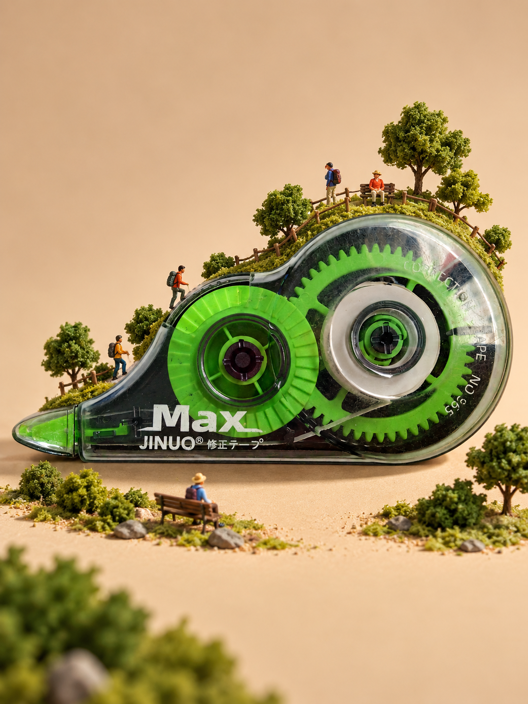

# Miniature World · Miniature Photography Skill

**Turn everyday objects into small worlds with a story.**

An Agent Skill for Codex and Claude Code that finds visual connections in an object's shape, texture and structure, plans a miniature scene, and uses available image tools to generate and revise it. Inspired by Tatsuya Tanaka's mitate photography.

[中文](README.md) · [Installation](#getting-started) · [18 representative cases](examples/SELECTED.md)

> Experimental candidate **v0.1.0-rc2**. The repository is currently private. Local installation, generation and editing in both hosts still need end-to-end validation. No stable release has been published.

## See the idea

| Correction tape → hiking trail | Notebook → bicycle rack |
| --- | --- |
|  |  |

These are AI-generated development examples. Each product has one representative image; limitations and evidence are recorded in the [case collection](examples/SELECTED.md) (Chinese). They are not proof of local-host compatibility or exact product fidelity.

## Getting started

Clone the repository with an account that has access, or download its ZIP from the Code menu. Open the project in your local host.

```bash
git clone https://github.com/denggui-ai/create-miniature-world.git
cd create-miniature-world
```

The only installable source directory is `skills/create-miniature-world/`. Check for an existing installation before copying; compare rather than overwrite it.

| Host | Suggested project-local destination | Invoke after confirming discovery |
| --- | --- | --- |
| Codex | `.agents/skills/create-miniature-world/` | `$create-miniature-world` |
| Claude Code | `.claude/skills/create-miniature-world/` | `/create-miniature-world` |

Use one installation scope and verify the actual loaded files in a fresh task. The current Codex display label is `微缩造景`. Installation and update details are in [docs/INSTALL.md](docs/INSTALL.md) (Chinese).

Attach a product photo and ask:

> Turn this product into a miniature photograph. First propose three distinct concepts connected to its visible features. Do not generate an image yet.

Choose a concept, request one image, then give a specific revision such as “Make the figures smaller while keeping the product and composition.” Reading an image does not imply the generation tool can receive it. Without image tools, the skill can provide concepts and prompts only.

## The method

- **Find a connection:** notice a feature worth seeing differently.
- **Build a situation:** make that connection visible through action or spatial relationships.
- **Compose the image:** keep the original object, its new role and the overall image readable.
- **Review the result:** assess story, appearance and product fidelity separately, using visible evidence and comparisons when needed.

A story can be a small everyday moment. It does not need conflict, and it does not have to demonstrate the product's normal function. The product itself must contribute to the idea.

## Requirements and limits

Requires an image-reading host; generation, image references and editing each depend on tools actually available in that session. No model, credits, API keys or paid-service client are bundled. The default output is one opaque portrait image in a 3:4 ratio.

Product lettering, construction and figure scale can still be wrong. Exact SKU preservation and exact figurine matching are not guaranteed. The project's 1:64 planning value is not a universal scale used by the artist or Preiser. See [validation](docs/VALIDATION.md) and the [local test](docs/LOCAL_TEST.md) (Chinese).

## Inspiration and materials

With appreciation for [Tatsuya Tanaka / MINIATURE CALENDAR](https://miniature-calendar.com/about/) and the possibilities of mitate. This project's method is its own synthesis of visual study and experiments, not the artist's published workflow. [Preiser](https://www.preiserfiguren.de/) is a useful official reference for miniature figures and poses.

This is an independent project, with no official affiliation or endorsement from the artist or Preiser. Original project text and configuration use the [MIT license](LICENSE). Images and third-party materials are not automatically covered by MIT; see [THIRD_PARTY_NOTICES.md](THIRD_PARTY_NOTICES.md).

## Feedback and development

Report the host, loaded version, input, expected result and observed problem. Include an image only when you have permission to share it. Distinguish missing tools from unreadable stories, altered products and oversized figures; do not include secrets.

Codex developers start with [AGENTS.md](AGENTS.md); Claude Code developers start with [CLAUDE.md](CLAUDE.md). Both use the same [handoff](docs/DEVELOPMENT_HANDOFF.md). Keep one source in `skills/create-miniature-world/`; update installed copies deliberately. The repository and invocation identifier remain `create-miniature-world`.
