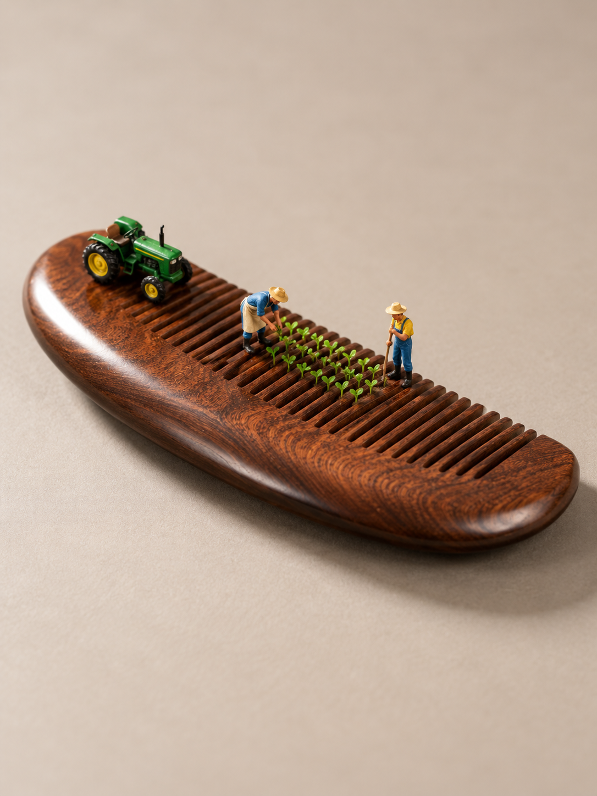
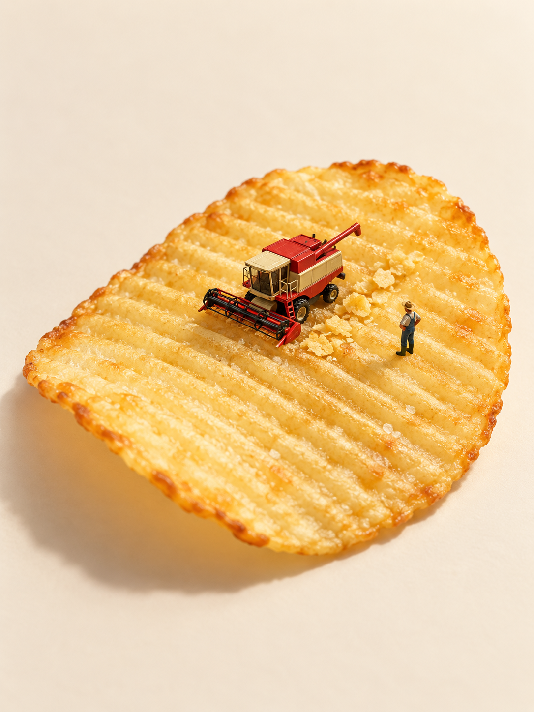

# 微缩摄影 Skill · Miniature World

**让日常物件，成为有故事的小世界。**

面向 Codex 与 Claude Code 的 **AI 微缩摄影与缩微场景创作 Skill**。受田中达也（Tatsuya Tanaka）的「见立 / mitate」创作启发，从日常物件的形状、纹理和结构出发，构思有故事的微缩世界，生成并迭代画面。自动成图需要所在环境提供相应图像工具。

[开始使用](docs/INSTALL.md) · [查看案例](examples/SELECTED.md) · [介绍页预览说明](site/README.md) · [English](README.en.md)

> **实验候选版 v0.1.0-rc2** · 当前为私有开发仓库。本机安装、生图和编辑闭环待验收；正式Release尚未发布。

## 从一个物件，发现另一个世界

以下为开发期间的AI生成案例，每件产品选一张代表图。画面展示创意方向，具体商品保真与已知不足见[18组案例详情](examples/SELECTED.md)。

| 修正带 · 山地步道 | 木梳 · 齿间农田 |
| --- | --- |
|  |  |
| 外壳的起伏轮廓，成为徒步路线。 | 平行排列的梳齿，成为耕作的田垄。 |

| 笔记本 · 装订圈停车架 | 薯片 · 波纹秋收 |
| --- | --- |
|  |  |
| 装订圈成为停放自行车的结构。 | 金黄的波纹与碎屑，成为秋收的田垄与收获。 |

[继续看回形针、马克杯、小青柑等案例 →](examples/README.md)

## 开始使用

1. **获取项目**：克隆仓库，或从 Code → Download ZIP 下载并解压；当前需要仓库访问权限。
2. **安装Skill**：按[安装说明](docs/INSTALL.md)选择 Codex 或 Claude Code。唯一安装源为 `skills/create-miniature-world/`。
3. **上传商品图，先看方案**：复制下面与你的工具对应的一句。

| 环境 | 安装后发送 |
| --- | --- |
| Codex | `使用 $create-miniature-world，把这张商品图做成微缩摄影。先给三个有明显区别的创意，不要立即生图。` |
| Claude Code | `/create-miniature-world 把这张商品图做成微缩摄影。先给三个有明显区别的创意，不要立即生图。` |

选好方案后，让助手生成一张；再用一句具体反馈修改，例如「人物小一点，商品和构图保持不变」。没有生图工具时，可先得到方案与提示词。首次运行可用[本机验收](docs/LOCAL_TEST.md)确认实际能力。

## 你可以怎样和它沟通

| 你说什么 | 它应该怎样处理 |
| --- | --- |
| 创意你来定，直接做一张 | 读物件、比较候选后自主选案，工具可用时生成 |
| 先看方案，不要生图 | 给三个有差异的方案，等待选择 |
| 只给我生图提示词 | 输出文字，不调用生图 |
| 人物再小一些 | 调整人物及相关道具比例，保护商品 |
| 只把光线调暖 | 工具支持时编辑当前图，保留故事与构图 |
| 没看懂这个故事 | 回查物件联系、人物动作和空间关系，必要时换情境 |

有商品参考图时，默认保护其可见外观；只有物品名称时，默认自由创作。默认单张竖版3:4、不透明背景；初次生成遇明确约束错误时至多自动修正一次，用户后续修改另行处理。

## 四句话，说明创作方法

- **发现联想：** 找到商品值得被重新看见的特征。
- **建立情境：** 让行动或空间关系把联想显现出来。
- **组织画面：** 让原物、新角色和整体美感同时成立。
- **判断巧思：** 用可见证据和必要对照，区分成立、好看与保真。

我们要找的是：商品的某个特征被重新看见之后，才变得有意思的情境。故事可以只是一个生活片刻；不必演示商品用途，也不必安排冲突和结局。

## 适用条件与当前限制

适合从可见的轮廓、纹理、结构或开合关系中寻找联想。商品照片优先；不能只按「文具」「食品」等品类保证成功，也不能为了故事凭空改变商品结构。

- **运行能力**：需要可读图的宿主。自动成图需要生图工具，参考图创作需要图片输入，反馈编辑需要编辑能力；Skill不附带模型、额度或付费API客户端。
- **商品保真**：标签、文字、部件和尺寸仍可能生成错误。创意得到认可，不代表精确SKU还原通过。
- **微缩人偶**：比例、姿态和涂装需看图判断；严格匹配实物时需提供有权使用的参考图。项目1:64是规划值，不是作者或Preiser的统一比例，也不是生成尺寸保证。
- **验证状态**：已有历史案例与文件检查；两个宿主的真实本机闭环均待验收。详见[验证记录](docs/VALIDATION.md)。

## 创作启发与致敬：田中达也与见立

致敬微缩摄影家、见立作家**田中达也（Tatsuya Tanaka）**。他的 [MINIATURE CALENDAR](https://miniature-calendar.com/about/) 启发我们重新看见日常物件。本项目将作品学习和自身试验整理成创作方法，帮助使用者构思自己的微缩场景；这些步骤不是作者本人公布的工作流程。

人物动作和模型造型可参考 [Preiser官方网站](https://www.preiserfiguren.de/)。具体型号、比例及图片使用条件以对应资料为准。[人偶参考说明](examples/FIGURE_REFERENCES.md)记录现有材料与缺口。

本项目与田中达也、MINIATURE CALENDAR、Preiser无官方合作或背书关系。代码与自编文档采用[MIT许可证](LICENSE)；案例图和第三方素材不自动适用MIT。图片来源、用途和公开分发待核事项见[素材说明](THIRD_PARTY_NOTICES.md)。

## 反馈与继续开发

反馈时请说明：使用Codex还是Claude Code、实际加载版本、输入是什么、期待什么、实际发生什么；可附有权分享的成图及一句具体问题。缺工具、故事难懂、商品改错和人物过大应分别记录，勿上传账号信息或密钥。

| 入口 | 内容 |
| --- | --- |
| [安装与更新](docs/INSTALL.md) | Codex / Claude Code分别安装、触发与更新 |
| [代表案例](examples/SELECTED.md) | 18组产品，每组一张主案例与已知不足 |
| [案例与复盘](examples/README.md) | 更多精选、历史对照与原始编号 |
| [本机验收](docs/LOCAL_TEST.md) | 一次生成与一次反馈修改 |
| [开发交接](docs/DEVELOPMENT_HANDOFF.md) | Codex读AGENTS.md，Claude Code读CLAUDE.md |
| [发布说明](docs/PUBLISH.md) | 实验候选状态与正式发布条件 |

仓库与调用标识保持 `create-miniature-world`。核心只维护 `skills/create-miniature-world/` 一份源，安装目录是运行副本。
