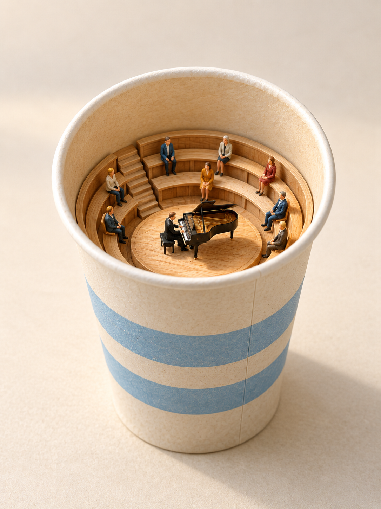
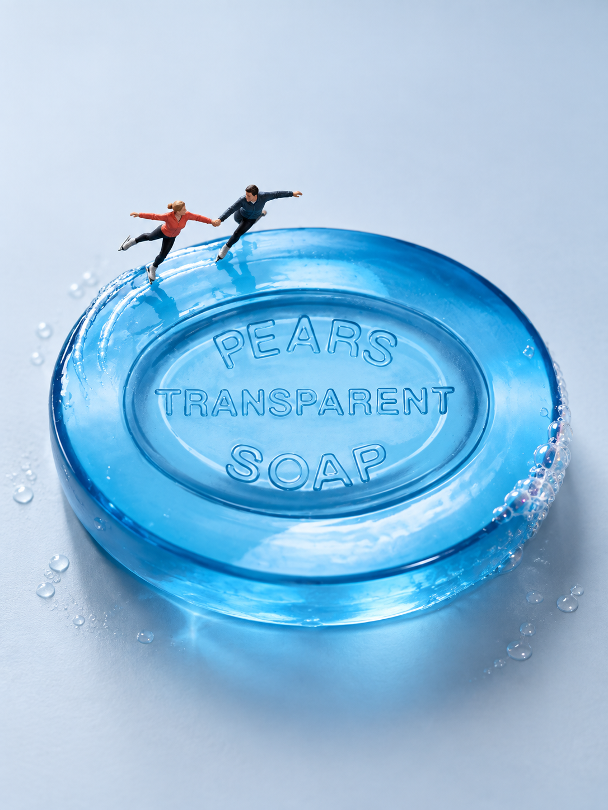
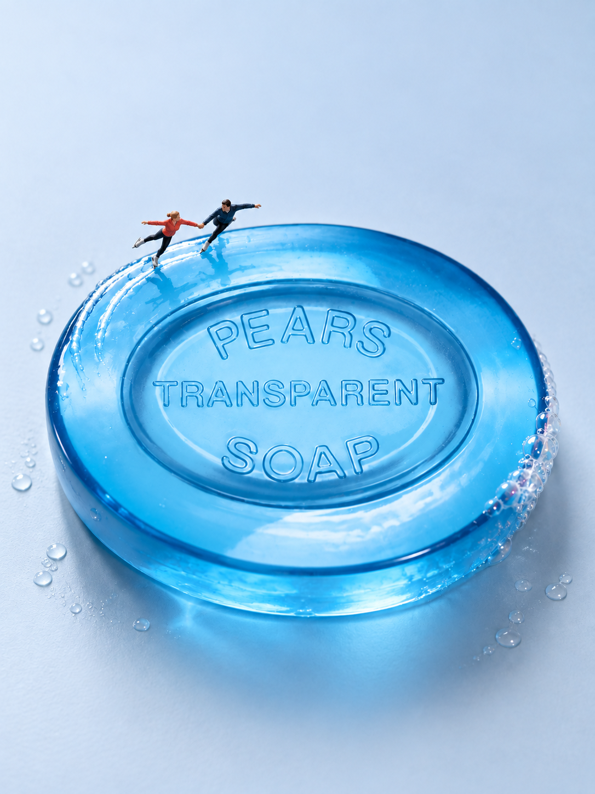

# 用一只纸杯开始微缩造景

给日常物件换一个角色，就能做出有故事的微缩画面。这篇先用纸杯三案说明怎样策划和看图选案，再用真实商品香皂的一次生成与一次编辑，区分创意认可和商品保真。

**这次为了学习比较，经用户同意给三个方案各生成一张；日常仍先在文字阶段选一个，再生成。** 三张均为1086×1448、每案一次，没有修图。

## 先说清你想怎么开始

按[安装说明](INSTALL.md)加载本 Skill 后，可以这样开口。直接生图或编辑还需要当前环境提供相应图像工具。

- **直接看图**：“把一次性纸杯做成微缩摄影，你选一个有趣的场景，直接出图。”
- **先挑方案**：“用一次性纸杯做微缩摄影，先给我三个方案和推荐，等我选好再出图。”
- **只要提示词**：“给我一段纸杯微缩摄影提示词，先不要生图。”

只有普通名称时，默认自由创作，允许组合或幻想改造，不承诺还原在售商品。纸杯三案没有商品参考图。若用于具体商品，请上传清晰原图并说明：“形状、颜色和印刷保持原样，不切割杯身。”看不清的结构仍需补图。

## 先从纸杯的特点策划

出图前比较了三个方向：

| 方案 | 借用纸杯的什么特点 | 文字阶段的取舍 |
| --- | --- | --- |
| A · 列车方向 | 横放杯口像入口，杯腔容纳车厢 | 物件和情节联系最直接，最初先选A |
| B · 马戏帐篷 | 倒扣杯体像帐篷轮廓 | 需要切门，并借助布帘、旗帜等提示场景 |
| C · 圆形露天剧场 | 杯口与内壁形成圆形围合 | 需要增加看台，担心只是往杯内摆一套场景 |

A先完成出图；随后为了教程中的实际比较，经用户同意，B、C各补一张。文字判断是起点，成图仍要重新看。

## 三张图，分别看见了什么

### A · 纸杯隧道口：列车出洞的联想

红色列车探出杯口、后车厢仍在杯内，轨道接向前景。卷边杯口让人想到生活中列车驶出隧道的入口，物件特点与具体情境直接相连。没有人物，列车与纸杯的大小关系也能建立微缩感；三案中，它对纸杯的可见改造最少。

原提示用了“tunnel（隧道）”，同时要求保留封闭杯底；看图后曾收窄称为“纸杯车库”。但用户进一步指出，列车出洞的画面仍会让人追问：“杯底是不是空的？”改名不能消除这种可见歧义。A的入口联想相对直接，但封底与隧道惯常理解的冲突未解决，结构逻辑仍未达标；不声称轨道贯通两端。图片没有修改，杯口下缘又被道砟遮挡，连接处无法完整核验。

### B · 马戏帐篷

引导者掀帘迎客，观众沿红毯入场，动作容易读懂。但故事依赖切开的门洞、布帘和彩旗，不只来自纸杯本身；仅凭这张图也可以读成剧场入口，不能说马戏表演已经可见。

### C · 音乐厅

成图把圆形剧场方向具体化成音乐厅：座席朝向中央钢琴，演奏与观看的关系清楚，画面也协调。这些优点曾让助手在看完三图后更偏向C。

但木阶梯座席与舞台大幅重构了杯内空间，故事主要由新增内装完成，纸杯更偏向盛放场景的容器。这是可见的空间改造，不能据图断言杯壁被切坏；部分人物脚部的支撑关系也仍看不清。

## 联想更直接，也要过结构这一关

文字阶段先选A；助手看图后曾因C的可读性和美感更偏向C。用户指出C靠大量内装重构杯内空间，A更容易联想到生活中的具体事情，因此一度回到A。随后用户也指出A的封底歧义。结论应收窄为：**A的联想相对直接，但结构逻辑未达标；这三张都不作为符合当前目标的成功案例。**

C的舞台和观众组织得完整，却让纸杯偏向容器；B的入场动作明确，但依赖切门和布景。画面丰富、动作可读与原物巧思，需要分别判断，不能用一个优点覆盖其他问题。这里比较的是这三张成图，不是判定整类创意永远不可用。

用户进一步明确的方向是：**保留原物，以小人的行动显现巧思，道具从简，形成“小人国”的感觉。** 选案优先考虑摆放、视角和动作，尽量不靠切挖或大量新装置改变原物。这是偏好优先级，不是放大或堆叠人偶，也不绝对禁止道具和改造。A中的列车仍是较强的第二主体，不能据此说它最符合这一新方向。

三图都没有验证具体SKU保真或精确模型比例，也不代表额外商用授权。三图仅作为本教程的教学对照，未加入18图精选；[来源与用途说明](../THIRD_PARTY_NOTICES.md#paper-cup-tutorial-source)单独记录。

## 再看一个真实商品：香皂上的双人滑冰

这次以[Pears薄荷透明蓝皂官方产品页](https://www.pearspuresince1807.com/us/en/p/pears-pure-gentle-with-glycerin-mint-extracts-extracts-bar-soap-3-53oz.html/00850022820427)为商品参考，先确认透明蓝色材质，再从香皂遇水湿滑的日常使用体验联想到双人滑冰。这里借用的是触感联想，不是把产品性能当作已测试的事实；画面用湿亮皂面与滑行动作显现这层关系。

**初稿v1**：香皂占画面主体，PEARS等字样仍可见。两人位于皂面后侧，牵手、张开另一只手臂并向侧方伸腿，滑冰的读法来自姿势与湿亮表面的配合。用户明确认可“湿滑→双人滑冰”的创意方向。

**一次编辑后的v2**：人物相对香皂明显缩小，牵手滑行、红蓝服装与皂面主要文字关系保留，原物更占主导。但这次同时要求的商品轮廓与机位校正未明显命中，严格SKU保真仍不判通过。两图机位存在差异，又缺实物厚度数据，不能从侧面露出的多少量化皂体厚度变化。

这次共一张初稿、一次编辑，均为1086×1448。它支持记录“方向获认可、缩小人偶部分命中”，不证明精确商品还原、真实Preiser型号或精确比例。两图只作教程对照，不加入18图精选；[来源与用途](../THIRD_PARTY_NOTICES.md#soap-skating-tutorial-source)另列。

## 选定后，再用一句话细调

先说保留什么，再点出最想改的一处。例如：“沿用这张列车图，只把光线调暖，纸杯、列车、轨道和构图保持不变。”**这只是反馈说法示范，纸杯三案没有运行暖光编辑。**

若创意本身没打动你，就说：“换一个方向，先看三个方案，不要生图。”不必每次都把三案生成出来。
