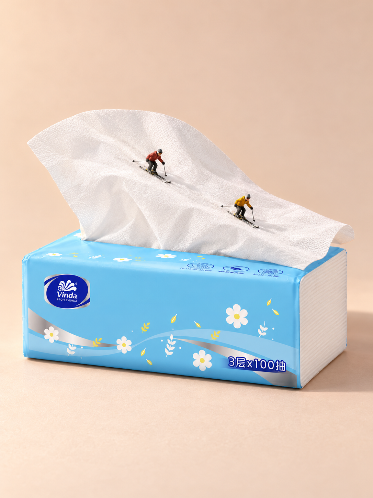
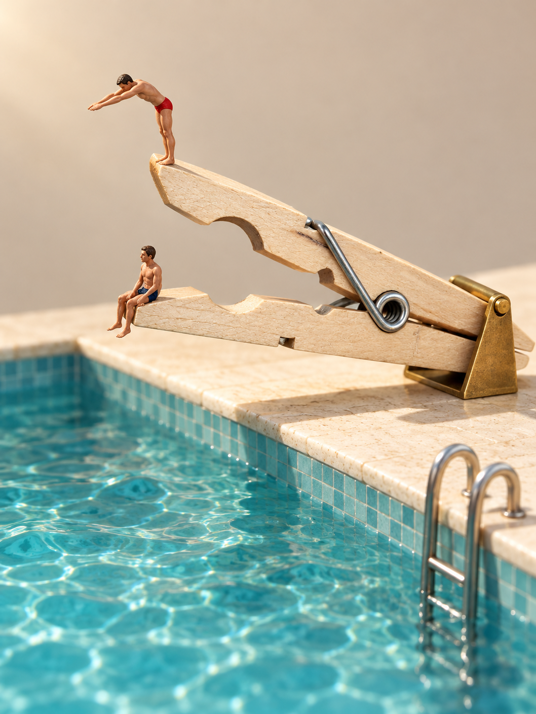
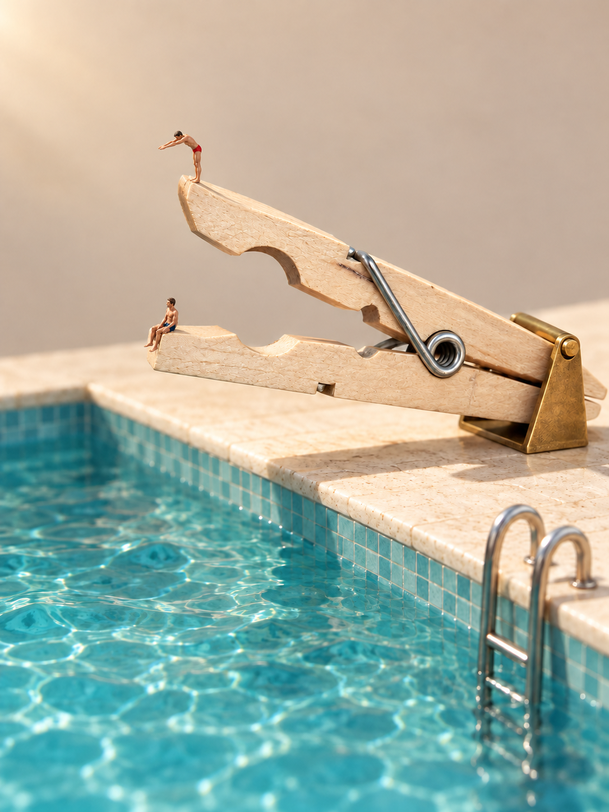

# 二创实战：纸巾雪坡、铅笔桥与木夹跳台

用户给物件与目标，Skill 负责构思、提示、生图和检查；看过结果后，再用日常话反馈。二创可以直接开始，不必先复刻一幅作品。

[安装与启用](INSTALL.md) · [看懂原作的巧思](ARTWORK_INTERPRETATION.md) · [案例页](../site/gallery.html)

## 纸巾雪坡：从熟悉的材质出发



白色、柔软、有褶皱的抽纸，被重新看成一道雪坡。两位小人的雪板贴在纸面上，下滑动作让联想成为一个正在发生的片刻。蓝色包体与薄纸边缘仍让人认得这是一包抽纸。

### Before：实际商品参考

助手选取了[维达 VS2102 官方商品参考](https://professional.vinda.com/product/VS2102.html)，并实际传给生图工具。它不是用户上传的照片，也未核实为实拍；这里提供来源链接，不转载官方商品原图。

### After：已有成图与反馈

上图是这次实际输出：1 次生成、0 次修正，1086 × 1448 像素。用户明确认可“抽纸的可以作为案例”。

纸片由参考中的直立扇形改成低垂宽曲面，这是有意改变柔性纸张的摆放。没有加入真雪或把包体改成山。纸纹比参考更粗，抽口部分被遮挡，小字与连接细节未全部核实；案例认可不等于严格商品保真通过。

## 日常使用，你只需说一句

先完成安装并确认宿主可读图、接收参考图和生图。下面是**教学示例，不是当时对话的逐字记录**。附上有权使用的商品图后发送：

**Codex**

```text
使用 $create-miniature-world。用这包抽纸做一张微缩场景，创意你来定。展示参考与结果，简短说明哪里变了。
```

**Claude Code**

```text
/create-miniature-world 用这包抽纸做一张微缩场景，创意你来定。展示参考与结果，简短说明哪里变了。
```

1. **你提供目标和素材。** 指定商品就附参考；探索普通物件也可以只说名称。有必须保留的细节，一并说明。
2. **Skill 完成策划与执行。** 观察物件、比较创意、安排动作和承托、编写提示、调用工具并检查结果，都由 Skill 处理。说“先看方案”时才先停下来供你选择。
3. **你看结果并反馈。** 例如“人物再小一点”“保持商品，只调暖光”。工具支持编辑时，Skill 据此修改并核对保留项。

没有相应图像工具时，只能得到方案或提示，不能把文字建议当作已完成的参考图编辑。

## 铅笔桥：两个物件共同成景


### Before：名称与文字方案

这次没有商品照片。助手提出“自然打开的笔记本形成浅谷，完整铅笔横跨书沟成为桥”，用户认可后，由 Skill 写成生图提示。用户没有填写摄影参数或长提示。

这是**文字输入 → 成图**，不能补一张照片冒充当时的 Before。

### After：已有成图与反馈

1 次生成、0 次重做，1086 × 1448 像素。用户评价“铅笔的不错”，并明确将它归为二创成功。

书沟的高低、铅笔的跨度和两端纸页承托共同建立桥的读法。三人的脚落在笔杆上，物件仍可辨认。实际三人全部在铅笔上，没有实现提示中的进桥、过桥、离桥分布；书本左右边界也被裁切。认可针对这张画面，不代表每条提示都已完成。

<details markdown="1">
<summary>可选阅读：Skill 如何把联想写进提示</summary>

抽纸案例抓住薄、白、可弯折的纸面，让雪板贴面、人物朝下坡移动；暖浅色背景和斜上方柔光帮助看清纸边与接触。铅笔桥则明确两端落在纸页上，中段跨过书沟，取景同时看见跨度与承托。

这些是 Skill 的策划工作，不是用户作业。背景、人物数量与摄影方式服务当前关系，也不是所有物件必须照搬的模板。

- [纸巾雪坡：实际工具提示全文](../examples/prompts/tissue-ski-20261008.txt)
- [笔记本与铅笔桥：实际工具提示全文](../examples/prompts/notebook-pencil-bridge-20261008.txt)
- [木夹跳台：初图提示](../examples/prompts/clothespin-diving-v1-20261009.txt) · [修改提示](../examples/prompts/clothespin-diving-v2-20261009.txt)

上文解释是教学归纳；链接文件保留本次真实调用提示。没有对照实验，不能将一张图的成功归因于某一句提示。

</details>

## 木夹跳台：一张商品照片，一句修改



张开的木夹，两片木臂一高一低伸向池面，成了双层跳台。上层红裤者前倾伸臂，下层蓝裤者坐着等。木臂、半圆缺口和银色弹簧仍让人认得这是一只木夹；黄铜底座被画成跳台支座，是场景里的构件，不是夹具。

### Before：仓库自带的公有领域照片

输入是本仓库的 [`examples/clothespin-public-domain.jpg`](../examples/clothespin-public-domain.jpg)（Commons 公有领域，前景一只被手指按开的浅色木夹），通过 Codex CLI 在本机实际传给生图工具。这是普通商品照片，不是品牌 SKU。

### After：一次生成，再一句修改

2026-10-09，Codex CLI 0.161.0 按当时的 SKILL（提交 `f063453`）自主选案：比较了木臂吊桥、张口峡谷、双层跳台三个方向，选跳台。1 次生成、0 重试，1086 × 1448 像素。提示 224 词，没有禁止清单。

看图后用户只说了一句：**"人再小一半，其他都别动。"** Skill 在同一会话做了唯一一次编辑：



编辑提示把范围写成"只改两人物的尺寸，锚定脚与臂尖、座与臂尖的接触点，其余全部保持"。结果两人物约缩至一半，站姿、坐姿与接触保留；木夹、弹簧、底座、池沿、扶梯、机位基本不变，木纹比初图略明显。1 次编辑、0 重试。用户认可这个创意。

已知边界：下臂尖端、木纹与弹簧有重绘，严格商品保真不判通过；无人偶实物参考，不认证型号或物理比例；"人再小一半"是画面比例，不是 1:64 换算。两张图的实际提示见 [`examples/prompts/`](../examples/prompts/)。

## 三种方法，各有入口

抽纸从材质与形态出发，铅笔桥从物件组合出发，木夹从物件自身张开的姿态出发。它们都让日常物件的可见特点参与新场景，均不是 Tape Runner 的直接改编。没有核查所有类似先例，不宣称前所未有。

三例均为 AI 输出，未使用人偶实物参考，不认证精确模型比例或 Preiser 型号。铅笔桥没有具体商品输入，不作 SKU 保真样板；木夹是公有领域普通照片，不是品牌商品保真案例。本页作为公开实验教程；图片不自动适用代码 MIT，也不提供额外商用或再分发授权，见[素材说明](../THIRD_PARTY_NOTICES.md)。

[继续看：胶带座为什么能成为跑步机？](ARTWORK_INTERPRETATION.md)
