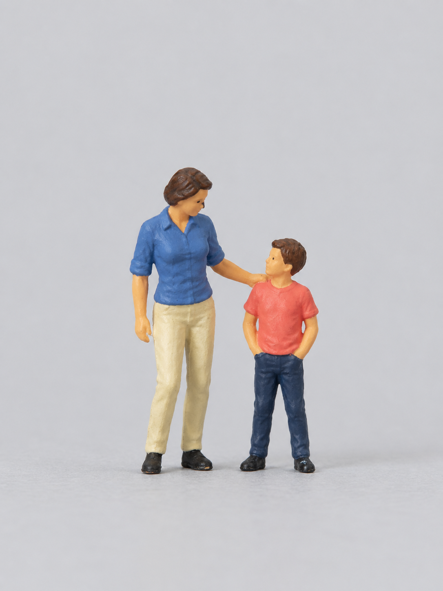

# 人偶参考：实物证据与AI诊断分开

## 本次找回的图

`ai-figure-diagnostic.png` 原名“微缩铁路人偶并肩而立.png”，档案标记为**AI生成**。成人穿蓝上衣、米色裤子，儿童穿红上衣、深色裤子，成人手放在儿童肩部。

它可用于讨论头身、四肢、涂装和动作接触，不是Preiser官方商品照，不代表已获用户认可，也不能用于校准精确型号或1:64实测比例。本次不把它安装成 `preiser-adults-reference.png` 或 `preiser-children-reference.jpg`，否则会把模型输出循环当作实物标准。

此前使用过的成人、儿童实物参考尚未在本次恢复中准确定位。严格Preiser造型匹配仍缺实际参考；不能声称这项缺口已经补齐。

## 推荐研究入口

[Preiser官方网站](https://www.preiserfiguren.de/)（Paul M. Preiser GmbH）：从 Katalogdownload 和 Diorama im Blick 等栏目寻找人物与组合。具体款式、型号及比例按实际产品资料记录，不把Preiser统称为1:64，也不把项目默认值当成田中达也全部作品的比例。

每次选图只需记录：产品页面/型号、来源、实际比例（未知则写未知）、图中动作、使用条件。观察重点为正常头身、细四肢、克制的服饰厚度与涂装，以及脚底支撑、手部接触、朝向和人物之间的关系。最后还需检查人物相对商品的大小；拉远镜头并不等于相对缩小人物。

参考照片可由用户自摄，或使用适合当前用途的已获许可图片。官方目录能下载、产品公开销售或项目推荐品牌，均不能替代具体照片的分发条件。已核对的官方条款记录见[素材说明](../THIRD_PARTY_NOTICES.md)。本文件仅保留推荐链接和本项目观察，没有打包官方照片。
