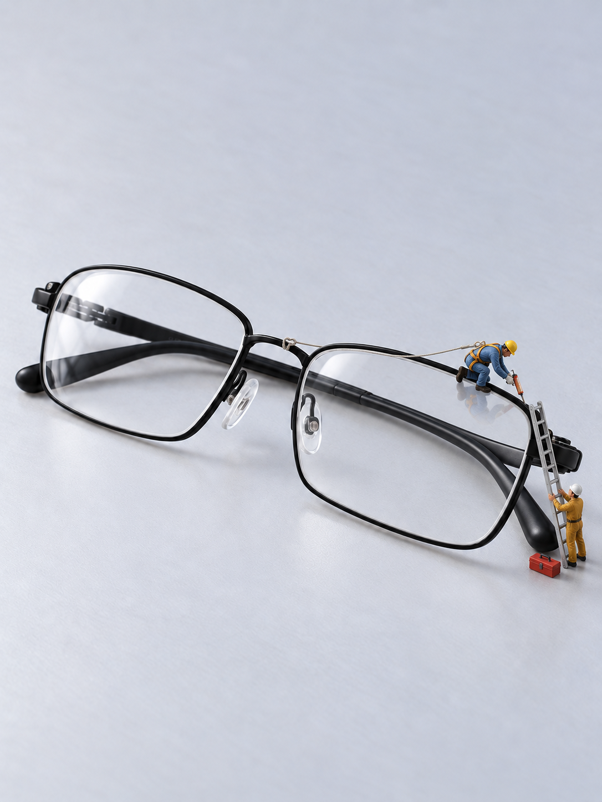
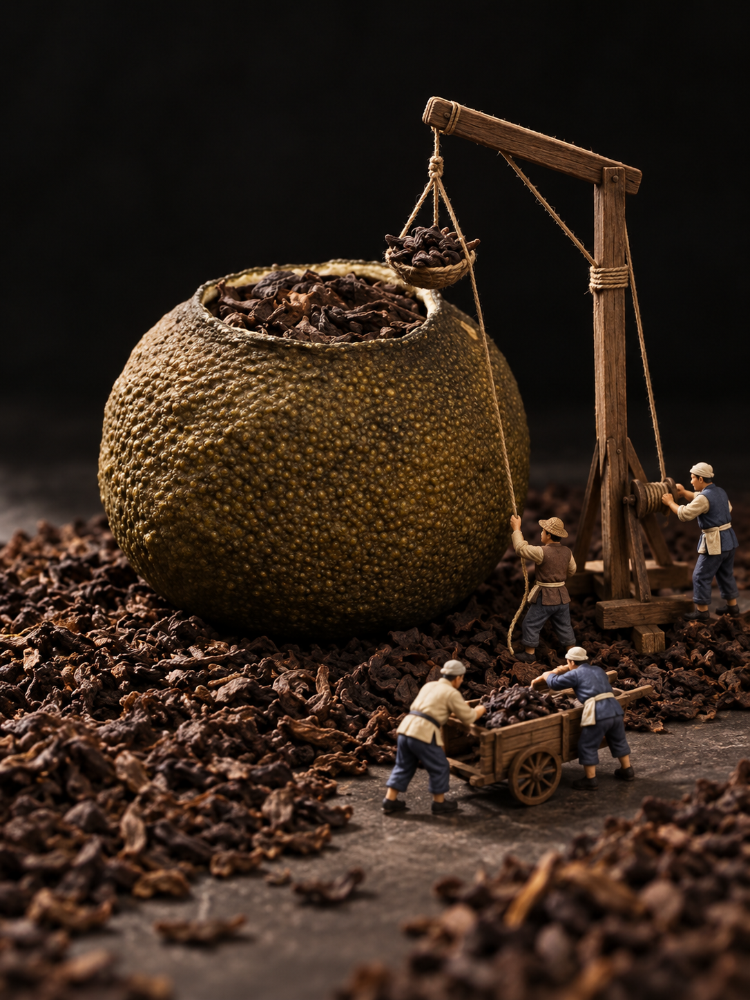
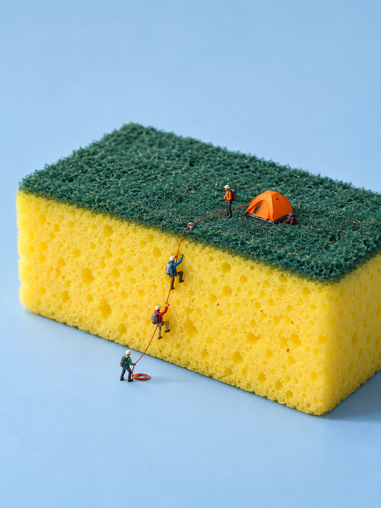

# 微缩摄影案例 · 一件产品，一个代表故事

以下为开发期间的AI生成案例，按产品分为18组，每组一张代表图。本页精选8张，项目首页精选4张；修正带采用山地步道，影院版本作为补充。其他版本与失败对照保留为开发资料。

| 修正带 · 山地步道 | 回形针 · 夹纸冰场 |
| --- | --- |
|  |  |

| 木梳 · 齿间农田 | 笔记本 · 装订圈停车架 |
| --- | --- |
|  |  |

| 眼镜 · 透明屋面维修 | 马克杯 · 雨中相遇 |
| --- | --- |
|  |  |

| 小青柑 · 茶仓装卸 | 厨房海绵 · 崖壁与营地 |
| --- | --- |
|  |  |

[查看18个产品的代表案例与已知不足](SELECTED.md)

## 开发资料

- [70图原始核对索引](REVIEW_INDEX.md)：固定编号、历史建议与本轮采用状态。
- [早期六组复盘](CASES.md)：成功方向、反例及反馈范围，不代表全部案例。
- [人偶参考说明](FIGURE_REFERENCES.md)：真实参考缺口与AI诊断图。
- [回形针试验1-2原文记录](paperclip-trial-1-2.md)。
- [素材来源与用途](../THIRD_PARTY_NOTICES.md)。

“展示采用”不等于商品保真、人偶比例、文字细节全部通过。学习复刻不与独立策划混标。旧24页核对册保留为选片历史，不另做版本覆盖。

## 本机试用输入

`clothespin-public-domain.jpg` 保留用于[本机验收](../docs/LOCAL_TEST.md)。主角是前景被手指按开的木夹；去掉手指后要重新判断开合与支撑，不将背景多个夹子合并。不固定跷跷板题材，商品尺寸未知。
