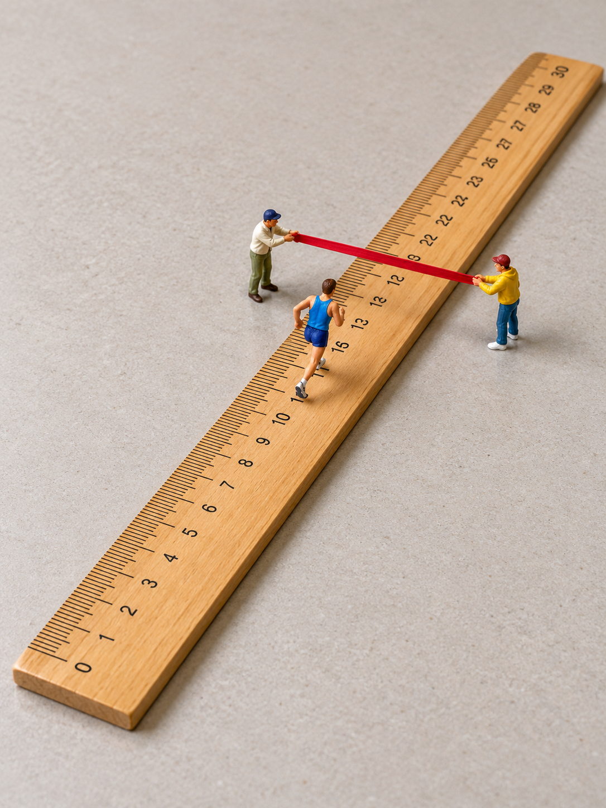
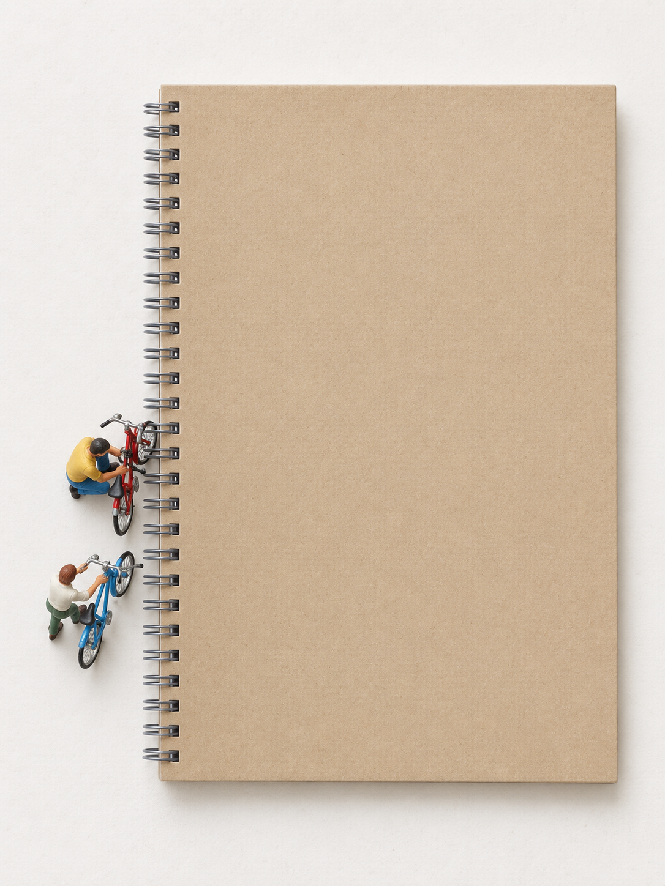
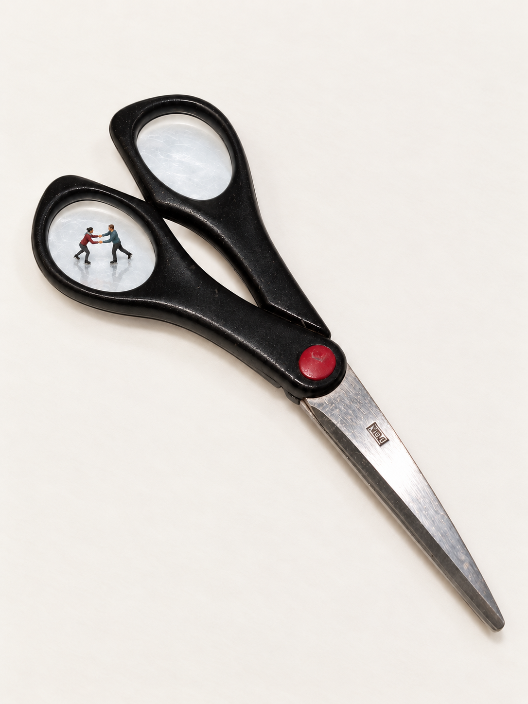

# 案例图与本机试用

2026-10-05恢复的精选历史档案：六组案例、九张AI生成图（含一张人偶诊断图），以及一张历史回形针真实输入。图片保持原字节，只重命名。本轮没有重新生图，也不是在用户本机完成的新测试。

用户追加要求后，已另整理[70张生成图核对索引](REVIEW_INDEX.md)与单独的PDF核对册：34张为建议入选，最终名单待用户确认；本目录六组仍是开发档案。

先看图，再读[案例记录](CASES.md)。用户认可的范围、当前观察和未验证项分别保留。以下是历史案例方向的代表图；除回形针早期图外，尚未恢复成图哈希与具体反馈逐一绑定的完整记录。

| 直尺冲线 | 木梳农田 | 笔记本停车 |
| --- | --- | --- |
|  |  |  |
| 动作易读；数字错误 | 梳齿参与农田联想；SKU未验收 | 装订圈参与停车；锁车动作未确定 |

| 回形针对照 | 剪刀反例 | 眼镜换情境 |
| --- | --- | --- |
|  |  |  |
| 对照早期跳水图看物件辨识；不是单变量实验 | 不能因场面漂亮就认定物件联系成立 | 回到透明斜面，改为边缘维修 |

- [案例记录与图片来源](CASES.md)：六组拆解、版本差异与文件校验值。
- [人偶参考说明](FIGURE_REFERENCES.md)：AI诊断图与真实Preiser参考的区别。
- [回形针早期试验原始提示词](paperclip-trial-1-2.md)：已匹配输入、输出和试验编号的一例。
- [素材范围](../THIRD_PARTY_NOTICES.md)：开发档案不自动等于公开图片包。

## 本机试用输入

`clothespin-public-domain.jpg` 是可再分发的真实木夹子照片。主角是前景被手指按开的浅色木夹，背景还有其他夹子；选择主体时不要合并。去掉手指后要重新判断支撑，不能默认悬空张开仍合理。

试用时不指定跷跷板，让Skill自主选择情境。商品尺寸未知，不认证精确模型比例。这张照片用于[本机流程验收](../docs/LOCAL_TEST.md)，不是承诺成功的固定模板。
