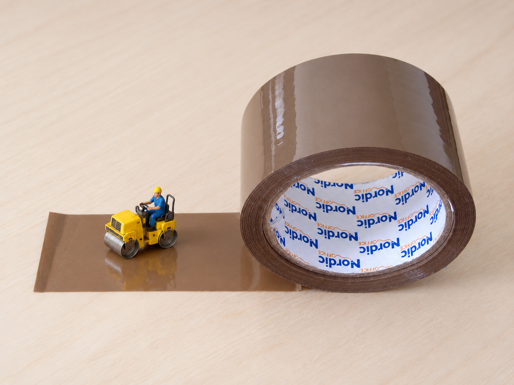
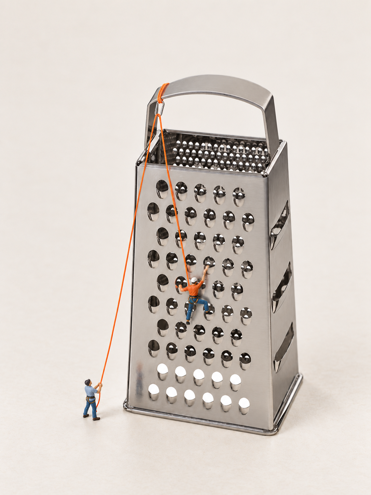
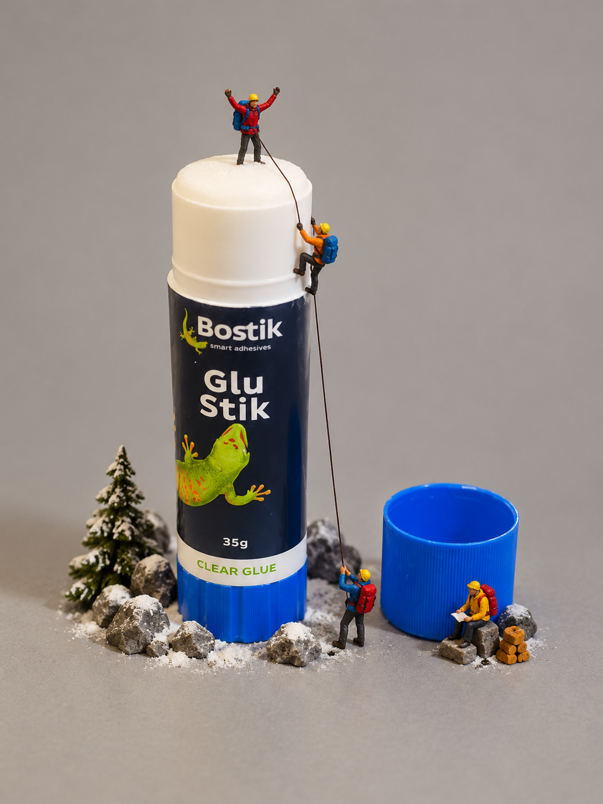
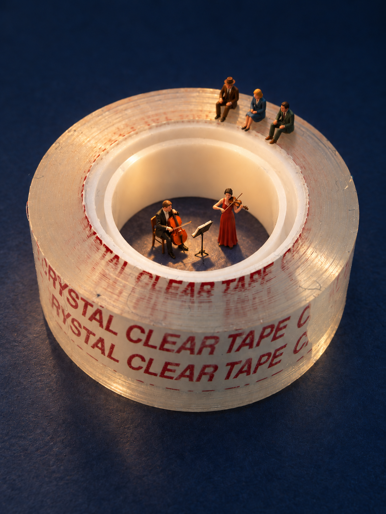
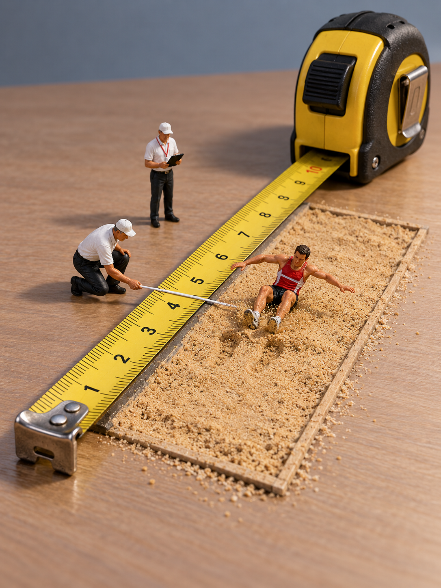
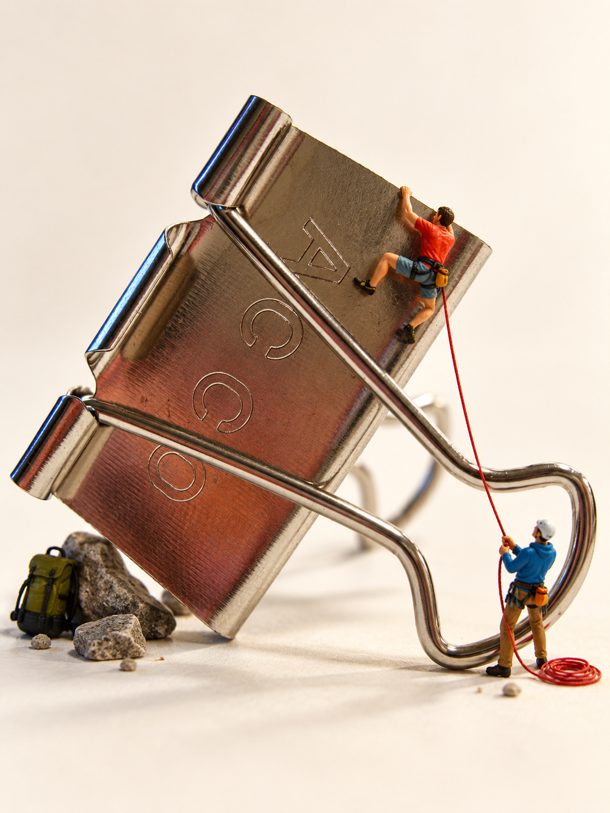
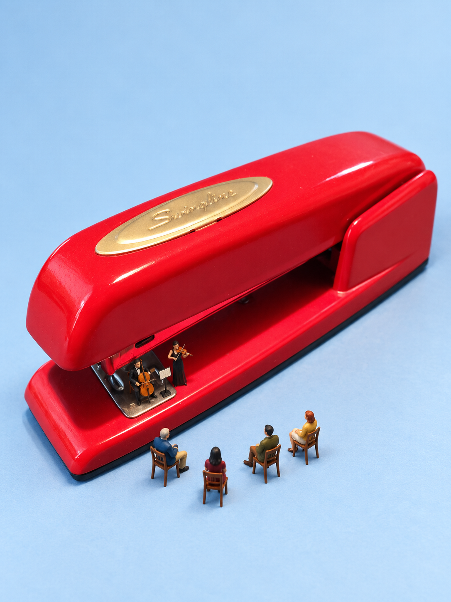
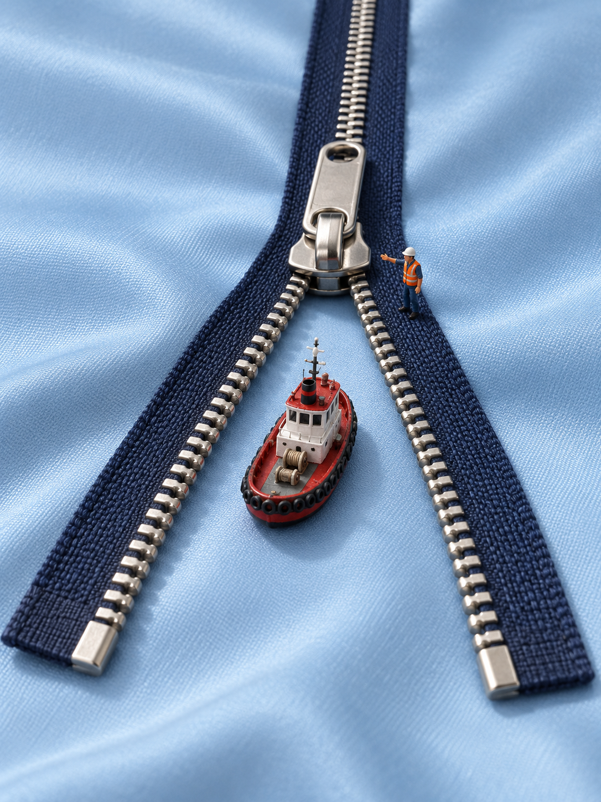

# 产品代表案例

2026-10-05：按用户同意的“每个产品只展示一张成功代表图”整理。原34张是选片池，不是34个独立产品；本轮采用18个产品展示分组，各选一图。其中4图用于项目首页，8图用于案例页精选。直尺G24另作带数字错误的创意补充，不列入这18张主案例。

这是用户授权助手择片后的展示选择，不回填成历史逐张认可，也不是全部商品保真验收。分组依据当前外观与题材：同一笔记本系列、海绵系列、订书机系列暂各合并展示；棕色封箱胶带与透明胶带外观、结构及场景角色明显不同，分列。将来核实SKU后可调整，不声称本次已识别18个准确型号。

选择先看原物能否辨认、动作和空间关系是否易读，再看人物相对大小与画面；同产品其他成功版本作为补充，不删除。所有图为历史AI生成，实际输入未完整恢复，素材范围见[说明](../THIRD_PARTY_NOTICES.md)。

## G52 修正带 · 山地步道（首页）

**商品联系与故事：** 弧形外壳形成起伏山路，微缩游客沿路游览。

**已知不足：** 用户曾明确选择此图；细小标识与商品尺寸未验收。

## G46 回形针 · 夹纸冰场（案例页精选）

**商品联系与故事：** 纸张维持夹持身份，长圆回折围出滑行路径。

**已知不足：** 线径、自由端及人偶造型仍需核对。

## G23 木梳 · 齿间农田（首页）

**商品联系与故事：** 平行梳齿如田垄，人物与农具沿齿隙劳动。

**已知不足：** 齿数、长度和厚度尚未逐项与商品输入核对。

## G30 笔记本 · 装订圈停车架（首页）

**商品联系与故事：** 自行车靠近金属装订圈，真实结构承担车架角色。

**已知不足：** 停车可读，不宣称锁车动作或具体SKU已通过。

## G05 眼镜 · 透明屋面维修（首页）

**商品联系与故事：** 倾斜镜片如玻璃屋面，人物在边缘协作维修。

**已知不足：** 接触、绳索锚点与眼镜具体型号尚未完整验收。

## G19 马克杯 · 雨中相遇（案例页精选）

**商品联系与故事：** 侧放杯腔容纳避雨者，人物招呼持伞来者。

**已知不足：** 新增地板、长凳服务情境；杯型保真未配对验证。

## G58 小青柑 · 茶仓装卸（案例页精选）

**商品联系与故事：** 柑皮开口成为仓口，人物吊运真实内容物茶叶。

**已知不足：** 商品输入与成图尚未完整配对。

## G70 厨房海绵 · 崖壁与营地（案例页精选）

**商品联系与故事：** 黄色孔隙如崖壁，绿色表面如草地，攀登通往营地。

**已知不足：** 人物与道具比例待审；不据此认证真实尺寸。

## G12 棕色封箱胶带 · 胶带铺路

**商品联系与故事：** 展开条带如新铺道路，微型压路机沿表面作业。

**已知不足：** 字样、胶带展开状态与具体参考尚未逐项比对。

## G15 刨丝器 · 攀岩练习

**商品联系与故事：** 真实刨孔成为攀点，顶部绳索与地面保护者构成关系。

**已知不足：** 安全绳路径、手脚接触仍需审图；不是实物使用教学。

## G50 固体胶 · 雪峰登顶

**商品联系与故事：** 白色胶芯如山顶，攀登者抵达顶部、队友在下方协作。

**已知不足：** 已匹配历史试验3-2；不意味着标签逐字或背面保真。

## G54 透明胶带 · 圆环音乐会

**商品联系与故事：** 中空圆环容纳演奏者，卷边成为观众席。

**已知不足：** 演奏关系可读；品牌字样、商品结构待核对。

## G56 铅笔 · 石墨公路

**商品联系与故事：** 铅笔留下的石墨痕迹成为道路，工人和压路机参与铺筑。

**已知不足：** 石墨是场景表现；笔身标识与材料保真未验收。

## G60 卷尺 · 跳远测量

**商品联系与故事：** 卷尺的测量用途与沙坑、运动员、裁判形成联系。

**已知不足：** 尺面数字及测量方向仍需核对。

## G64 长尾夹 · 斜面攀登

**商品联系与故事：** 金属斜面成为攀登面，双人通过绳索协作。

**已知不足：** 人物偏近；接触和支撑需另审，不作比例标准。

## G65 订书机 · 开口音乐会

**商品联系与故事：** 开口遮盖演奏者，外侧观众朝向演出位置。

**已知不足：** 品牌字样与开口状态未完成商品事实验收。

## G68 薯片 · 波纹秋收

**商品联系与故事：** 波纹纹理如田垄，收割机和人物使联想显现。

**已知不足：** 作为食品纹理创意，不认证特定包装商品。

## G69 拉链 · 运河拖船

**商品联系与故事：** 拉链分叉与布面构成水道，拖船驶向开合交界。

**已知不足：** 拉链齿、拉头结构和原商品输入未配对验收。

## 补充与开发对照

- **修正带G45影院**：[另一种联想](correction-tape-cinema-alternative.png)，保留在详情补充；主代表采用用户明确选择过的G52。
- **直尺G24冲线**：[创意补充](ruler-finish-line.png)，故事清楚但尺面数字有错，暂不作为成功主展示。
- 便利贴学习系列保留在[70图索引](REVIEW_INDEX.md)，待来源配对后单列学习案例。
- 同题材未选版本、失败图及AI人偶诊断仍保留在原档案；已有仓库文件不删除。详见[早期六组复盘](CASES.md)与[人偶说明](FIGURE_REFERENCES.md)。

## 原图溯源

文件原字节复制，仅使用英文文件名。G编号、原名和校验值沿用原70图档案。

| 编号 | 文件 | 原文件名 | SHA-256 |
| --- | --- | --- | --- |
| G52 | correction-tape-hiking.png | 绿轮修正带化身迷你太空舱.png | `0386054ff12a3dc529e17388f5f736954b1bf5fb8ca8da72d2cbaa30ca88f3cb` |
| G46 | paperclip-paper-after.png | 回形针夹纸上的滑冰瞬间.png | `f7cbb36c7f431e333beec77260a1b00208576ac65d93b645cc39a9114eb8f466` |
| G23 | comb-farm.png | 木梳上的袖珍农田.png | `759ee2d82e6dfba8982233a8de5c53e94bb50689b5ab111a7fe3dd464a8bcc29` |
| G30 | notebook-bike-rack.png | 笔记本边的微型自行车停放.png | `9bf8bde13be4bc57f9998770c051336ad5343bd4b6bbf994049a1c931ac015a0` |
| G05 | glasses-roof-repair.png | 倾斜眼镜上的屋顶维修.png | `f8e8ec34412e8b2a02dd763329e19640a76688c673bc1c6770326da15b684b3d` |
| G19 | mug-rain-shelter.png | 侧放陶杯里的雨中相遇.png | `20eb339f7e149f0d63f12bcbfac91fc35613ef2abd11c0e7af81653045dddf6e` |
| G58 | citrus-tea-loading.png | 柑皮茶仓的微型装卸.png | `7600b57ae14372f3edcf94e1fb17ea5ba97b59f04a2103fae5dde4d0b9d7b8a3` |
| G70 | sponge-climbing.png | 厨房海绵登山记.png | `e3b8a44a3425cac3549bcafc035e2240338987e5b582ff61805a723d6d2d6c28` |
| G12 | packing-tape-road.png | 胶带上的迷你压路机.png | `f65ef4ee2f1520e0005992da58324985629dbd094ab5adf48c7475190ae544ef` |
| G15 | grater-climbing.png | 刨丝器上的微型攀岩搭档.png | `83e7421e3df8e646fd88a9ad25407f7cc2a00ed6ba3ba6045f9dffce707e9f62` |
| G50 | glue-stick-summit.png | 白胶灯塔与蓝帽码头.png | `859b1687a5139f7e57d6f82bff5afbd0e404c7b840a7e2f90920dc1884c7a21e` |
| G54 | clear-tape-concert.png | 胶带卷上的微型音乐会.png | `58803cdc28a23f919afd250af168cdea3359c7b81cc3125fc7139c20575f9fba` |
| G56 | pencil-road.png | 铅笔铺出的石墨公路.png | `0f95f9c272a4f9c4b8180bab855a5552a374653cb77c864608005f0cc40430d8` |
| G60 | tape-measure-jump.png | 卷尺上的微型跳远赛.png | `151bafec50302531c4cea49daff0525a87f607563d2d648baa7db7510c7cf955` |
| G64 | binder-clip-climbing.png | 日常物件的微型奇遇.png | `249ebebb33ee1d44e5cc1c2a033d817dcd5cd6c91f94864cd262bc4eb6d0975e` |
| G65 | stapler-concert.png | 红色订书机里的微型音乐会.png | `c44f4f609603a7ce0b7bba51d73efae951df2136d17df55c710f27c03a8c6b4d` |
| G68 | potato-chip-harvest.png | 薯片上的迷你秋收.png | `9b9fe7351a8a9658bfc4a2628bab19d3f7f5e8ed0b0a1ef733eff16d52669fd5` |
| G69 | zipper-canal.png | 拉链运河小拖船.png | `bd937c7d39b636901647c9ed40a9ddcdf76402a3f0f9896b5a54d6067fbc73da` |
| G45 | correction-tape-cinema-alternative.png | 胶带投影的微型影院.png | `521b0e082ef67eec379a534314d0b7f0733adf133afec4539cfcd0f26dce8f65` |
